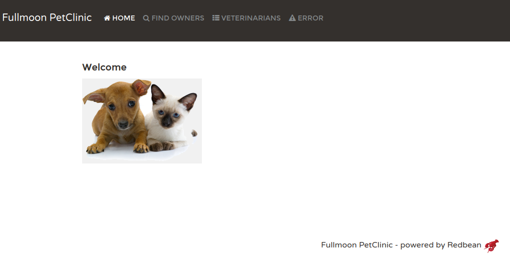

# fullmoon_petclinic
Spring petclinic ported to redbean/fullmoon

## Motivation
I became really interested in the redbean project and associated lua web farmework fullmoon.
As a Java developer, the "PetClinic" app is the web based hello world of Java since the EJB days.
So I decided to port the Spring petclinic version to redbean/fullmoon.

https://github.com/spring-projects/spring-petclinic

Redbean is an amazingly fast/tiny single file webserver and is part of Justine Tunney's cosmopolitan libc/actually portable executable ecosystem.

https://redbean.dev/

Fullmoon is a lua framework built specifically for redbean by Paul Kulchenko.

https://github.com/pkulchenko/fullmoon

* Note that fullmoon is included in this repo. It is a branch version that has a fix to allow 
easy db connections across forked processes (since redbean is a forking web server).

* https://github.com/pkulchenko/fullmoon/tree/forkable-storage

Paul is also the author of ZeroBrane which is a wonderful Lua IDE that I used while porting this project.

https://studio.zerobrane.com/

## Benchmarks

If interested in benchmarks please click [Benchmarks](BENCHMARKS.md)


## Instructions to run
1. Clone repo
2. Examine the makefile - it has multiple targets to make your life easier
3. I assume your system has zip/unzip installed and available at the command line
4. The makefile will download a redbean executable from redbean.dev and then zip the contents of /srv into it

### Start in interactive mode
```
make start
```

Port defaults to 8000 and is sepecified at the bottom of petclinic.lua file

Open http://localhost:8000

### Start as a background process
```
make start-daemon
```

In this mode a redbean.pid file will be created and all logs will go to redbean.log

To stop the daemon use
```
make stop-daemon
```

* You may need to manually remove redbean.pid if the process crashes or you otherwise stop the redbean process without called stop-daemon

The make file is a lightly modified version copied from 
https://github.com/ProducerMatt/redbean-template

### Screenshot 




### Hot reload

1. On linux you should be able to run ```sh reload.sh``` to hot reload as you develop
2. You need inotify-tools installed
3. As you develop tail -f redbean.log to look for issues

reload.sh credit to -> https://www.baeldung.com/linux/monitor-changes-directory-tree


### License
MIT license (see LICENSE file)

Please see the fullmoon/redbean/spring petclinic sites for respective licenses


